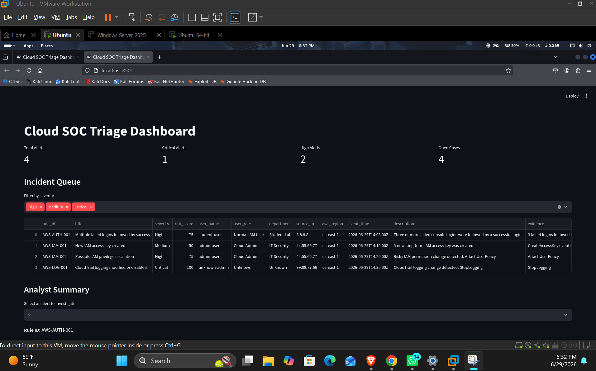

# Cloud SOC Triage Engine

[](https://github.com/RohithJoginpelly/python-cloud-soc-triage-engine/actions/workflows/test.yml)


## Overview

Python Cloud SOC Triage Engine is an offline-first cloud security detection and triage platform built for SOC analyst portfolio demonstration.

The project simulates a realistic cloud security workflow: it ingests AWS CloudTrail-style logs, detects suspicious behavior, enriches alerts with local context, correlates related activity into incidents, maps detections to MITRE ATT&CK, prioritizes notifications, supports analyst case management, and generates incident reports.

The main version runs fully offline with sample telemetry, so recruiters and reviewers can run the project without an AWS account. Optional AWS CloudTrail Event History ingestion is also supported for users who want to test with real AWS account activity.

## Project Impact

| Capability | Current Result |
|---|---|
| CloudTrail-style events processed | 10 sample events |
| Rule-based detections | 7 alerts |
| Correlation detections | 1 compromise-chain alert |
| Total incidents generated | 8 incidents |
| MITRE ATT&CK mapped detections | 8 mapped alerts |
| Analyst reports generated | 8 markdown reports |
| Automated tests | 9 passing tests |
| Notification routing | Critical = P1, High = P2, Medium = no notification |
| Runtime model | Offline by default, optional AWS ingestion |

## SOC Workflow

The project follows a practical SOC triage story:

1. Ingest CloudTrail-style logs.
2. Normalize events with a Python parser.
3. Detect suspicious IAM, root, S3, CloudTrail, and network activity.
4. Correlate related events into a possible cloud account compromise chain.
5. Score severity and risk.
6. Map detections to MITRE ATT&CK.
7. Enrich alerts with local user and IP context.
8. Store incidents in SQLite.
9. Prioritize P1/P2 notifications.
10. Investigate incidents in the authenticated FastAPI analyst dashboard.
11. Generate markdown incident reports.

## Why This Project Stands Out

This is not only a log parser. It models an end-to-end SOC workflow.

The project includes detection logic, enrichment, correlation, case management, reporting, Docker support, tests, optional AWS ingestion, analyst summaries, and notification routing. It is designed to be easy to run locally while still showing realistic cloud security engineering and analyst skills.


## Dashboard Screenshot



## Architecture

CloudTrail-style logs are processed through a Python parser, detection rules, correlation engine, severity scoring, MITRE ATT&CK mapping, local enrichment, SQLite case database, Streamlit dashboard, and generated incident reports.

## Key Features

* Parses AWS CloudTrail-style JSON logs
* Detects suspicious IAM, root, S3, CloudTrail, and security group activity
* Detects multi-step cloud compromise behavior using correlation logic
* Maps detections to MITRE ATT&CK tactics and techniques
* Adds local enrichment from user and IP context files
* Assigns severity and risk scores
* Stores incidents in a local SQLite case database
* Provides an authenticated, role-based FastAPI dashboard for SOC triage
* Supports analyst case status updates and notes
* Generates markdown incident reports
* Includes SOC playbooks
* Includes automated pytest coverage
* Supports Docker-based local execution
* Runs fully offline with no cloud cost

## Detection Coverage

| Rule ID      | Detection                                  | Severity |
| ------------ | ------------------------------------------ | -------- |
| AWS-AUTH-001 | Multiple failed logins followed by success | High     |
| AWS-IAM-001  | New IAM access key created                 | Medium   |
| AWS-IAM-002  | Possible IAM privilege escalation          | High     |
| AWS-LOG-001  | CloudTrail logging modified or disabled    | Critical |
| AWS-ROOT-001 | Root account console login detected        | Critical |
| AWS-S3-001   | Possible public S3 bucket exposure         | High     |
| AWS-NET-001  | Security group opened to the internet      | High     |
| AWS-CORR-001 | Possible cloud account compromise chain    | Critical |

## Correlation Detection

The project includes an advanced correlation rule that detects a possible cloud account compromise chain.

Example attack chain:

* Console login activity
* Access key creation
* IAM privilege change
* CloudTrail logging modified

When this sequence is detected within a short time window, the engine creates:

AWS-CORR-001 Possible cloud account compromise chain

This demonstrates detection logic beyond simple single-event matching.

## MITRE ATT&CK Mapping

| Rule ID      | MITRE Technique                           |
| ------------ | ----------------------------------------- |
| AWS-AUTH-001 | T1110 Brute Force                         |
| AWS-IAM-001  | T1098 Account Manipulation                |
| AWS-IAM-002  | T1098 Account Manipulation                |
| AWS-LOG-001  | T1562.008 Disable or Modify Cloud Logs    |
| AWS-ROOT-001 | T1078 Valid Accounts                      |
| AWS-S3-001   | T1530 Data from Cloud Storage             |
| AWS-NET-001  | T1578 Modify Cloud Compute Infrastructure |
| AWS-CORR-001 | T1078 / T1098 / T1562.008                 |

## Local Enrichment

The engine enriches alerts using local context files:

* `data/context/known_ips.csv`
* `data/context/users.csv`

Enrichment fields include:

* IP type
* IP label
* IP reputation
* Business-hours context
* Normal AWS region
* Unusual region flag
* User risk
* Local risk notes

Example:

CloudTrail logging was modified by a critical user from a suspicious IP address.

## Case Management Dashboard

The V2 analyst dashboard provides authenticated case management, ownership, notes, status transitions, audit history, and role-based administrative controls.

Dashboard capabilities include:

* Alert metrics
* Severity filtering
* Status filtering
* User filtering
* IP reputation filtering
* Incident queue
* Incident detail view
* MITRE ATT&CK section
* Local enrichment section
* Evidence view
* Recommended analyst actions
* Case status updates
* Analyst notes

Supported case statuses:

* Open
* Investigating
* Escalated
* Closed
* False Positive

## Incident Reports

The project generates markdown incident reports for each case.

Generated reports are stored in:

`reports/generated/`

Each report includes:

* Executive summary
* Detection details
* Entity context
* Local enrichment
* MITRE ATT&CK mapping
* Evidence
* Recommended analyst action
* Analyst notes
* Case timeline
* Closure guidance

## Project Structure

```text
dashboard/
  app.py

data/
  alerts/
  context/
  incidents/
  raw/

playbooks/
  access_key_created.md
  cloudtrail_tampering.md
  failed_login_success.md
  iam_privilege_escalation.md
  public_s3_exposure.md
  root_account_usage.md
  security_group_open_to_internet.md

reports/
  generated/
  incident_report_template.md

screenshots/
  dashboard.png

src/
  correlation.py
  database.py
  detections.py
  enrichment.py
  incident_queue.py
  local_enrichment.py
  main.py
  mitre_mapping.py
  parser.py
  report_generator.py
  severity.py

tests/
  test_soc_engine.py
```

## Run Locally

Create and activate a virtual environment:

```bash
python3 -m venv venv
source venv/bin/activate
```

Install dependencies:

```bash
pip install -r requirements.txt
```

Run the SOC engine:

```bash
python src/main.py
```

Generate incident reports:

```bash
PYTHONPATH=src python src/report_generator.py
```

Start the dashboard:

## Run the V2 API with Docker

Build the hardened production image:

```bash
sudo docker build -t ai-soc-copilot:v2-production .
```

Create an ignored production environment file:

```bash
cp .env.production.example .env.production
chmod 600 .env.production
```

Configure independent values for `SOC_API_KEY` and `SOC_SESSION_SECRET`, then start the container:

```bash
./deploy/run-production-container.sh
```

The V2 API is available locally at:

```text
http://127.0.0.1:8000
```

Operational checks:

```bash
curl -i http://127.0.0.1:8000/health/live
curl -i http://127.0.0.1:8000/health/ready
```

The launcher uses a non-root user, a read-only root filesystem, dropped capabilities, resource limits, persistent SQLite storage, and localhost-only port binding.

See `docs/DEPLOYMENT.md` and `docs/CONFIGURATION.md` for production guidance.

## Run Tests

Run the automated test suite:

```bash
python -m pytest -v
```

Expected result:

```text
413 passed
```

The tests validate:

* Parser loads CloudTrail-style events
* Normalized events contain required fields
* Detection rules generate expected alerts
* Correlation engine generates compromise-chain alert
* Full pipeline generates 8 alerts
* MITRE mapping is added
* Local enrichment is added
* Correlation alert has critical risk score
* Report generator creates markdown content

## SOC Playbooks

The project includes response playbooks for:

* Multiple failed logins followed by success
* New IAM access key creation
* IAM privilege escalation
* CloudTrail logging tampering
* Root account usage
* Public S3 bucket exposure
* Security group opened to the internet

Each playbook includes investigation steps, evidence to review, containment guidance, and closure criteria.

## Skills Demonstrated

* AWS CloudTrail log analysis
* Cloud security monitoring
* IAM threat detection
* Cloud misconfiguration detection
* SOC alert triage
* Detection engineering
* Correlation logic
* MITRE ATT&CK mapping
* Local alert enrichment
* Risk scoring
* SQLite case management
* Secure FastAPI analyst dashboard development
* Incident response documentation
* Python automation
* Pytest validation
* Docker packaging
* Git and GitHub workflow

## Cost Design

This project is intentionally designed to run offline.

No AWS account is required for the main version.

No paid cloud services are required.

The sample CloudTrail-style logs allow the full detection, triage, reporting, and dashboard workflow to run locally.

## Version 2.0 Release

Version 2 transforms the original CloudTrail triage engine into a multi-source, evidence-grounded AI SOC Copilot with an authenticated FastAPI analyst dashboard, deterministic correlation and risk scoring, MITRE ATT&CK mapping, Copilot-assisted investigation, persistent case management, audit trails, role-based access control, operational observability, and hardened container deployment.

## Future Improvements

* Optional AWS CloudTrail Event History collector
* Optional S3 CloudTrail log collector
* YAML-based detection rules
* Additional cloud attack-chain detections
* More local enrichment sources
* Export reports as PDF
* Add authentication to the dashboard
* Add Slack or email notification simulation
* Add severity trend charts


## Recent Updates

The project was recently extended with optional AWS ingestion and improved SOC triage features.

Completed additions:

- Optional AWS CloudTrail Event History collector
- Ingestion configuration using config/ingestion_config.json
- Source tagging for alerts and incidents
- Legacy V1 ingestion status tracking preserved for historical compatibility
- Rule-based analyst summaries for each incident

New files added:

- src/aws_event_history_collector.py
- src/ingestion_config.py
- src/alert_summary.py
- config/ingestion_config.json

The AWS collector is optional. The project still runs fully offline by default using sample CloudTrail-style logs. When AWS logs are collected, the same detection, enrichment, MITRE mapping, reporting, and dashboard workflow can process the AWS-collected file.

Example AWS-collected input command:

SOC_INPUT_FILE=data/raw/aws_cloudtrail_event_history.json python src/main.py


## Local Alert Notification Outbox

The project includes a local alert notification outbox that simulates SOC email notifications without requiring real email credentials.

When the detection engine generates High or Critical alerts, the notification service creates simulated email-style alerts and stores them locally.

Generated notification outputs:

- data/notifications/notification_outbox.json
- data/notifications/email_outbox.txt

The notification outbox includes:

- Notification ID
- Alert severity
- Rule ID
- Alert title
- Risk score
- User
- Source IP
- MITRE technique
- Analyst summary
- Recommended analyst action

The repository retains the local notification outbox for safe offline demonstrations without requiring live email credentials.

This feature demonstrates SOC alerting workflow design while keeping the project safe for GitHub. Real email sending is intentionally not enabled by default, so no passwords, API keys, or SMTP credentials are required.


## Notification Priority Logic

The local notification outbox uses priority-based alert routing:

- Critical alerts generate P1 immediate notifications
- High alerts generate P2 normal notifications
- Medium alerts do not generate notifications

Notification subjects include both priority and severity, for example:

- [P1][Critical] Cloud SOC Alert - Root account console login detected
- [P2][High] Cloud SOC Alert - Possible public S3 bucket exposure

This simulates a realistic SOC notification workflow where only high-priority security events are escalated into the alert outbox.


## Real AWS CloudTrail Event History Demo

This project has been tested with both local sample CloudTrail logs and real AWS CloudTrail Event History logs collected from an AWS account.

For safety, the raw AWS export is not committed because it may contain account IDs, ARNs, usernames, IP addresses, request IDs, and access key identifiers. Instead, the repository includes a sanitized real AWS sample:

    data/raw/aws_cloudtrail_real_sanitized_sample.json

Run the engine against the sanitized real AWS sample:

    SOC_SOURCE_MODE=aws_event_history \
    SOC_SOURCE_NAME=aws_cloudtrail_real_sanitized_sample \
    SOC_ENVIRONMENT=aws_lab_sanitized \
    SOC_INPUT_FILE=data/raw/aws_cloudtrail_real_sanitized_sample.json \
    python src/main.py

The sanitized sample includes real-world AWS management event types such as IAM access key creation and IAM policy attachment activity, with sensitive account-specific values replaced by safe demo values.
